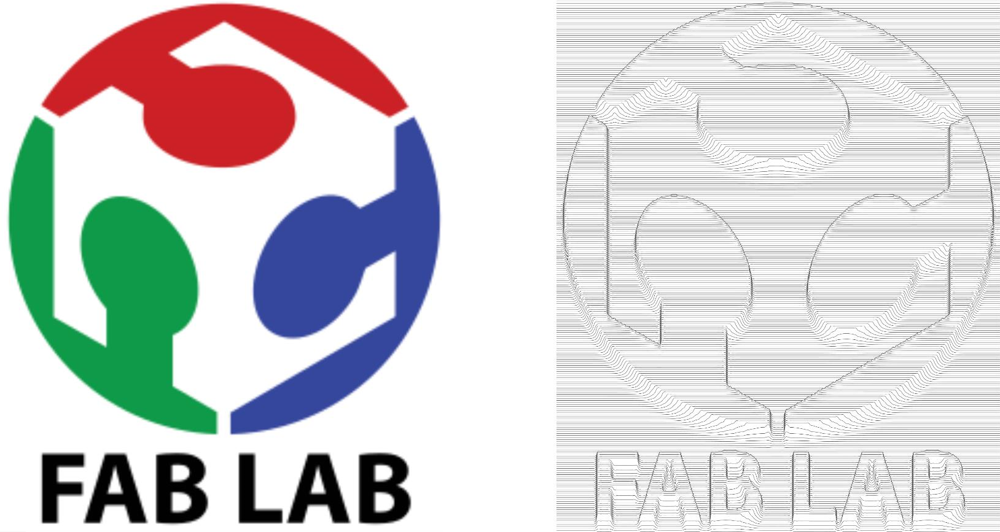
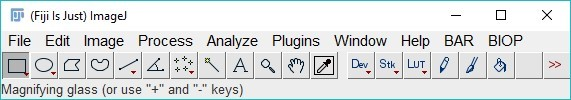
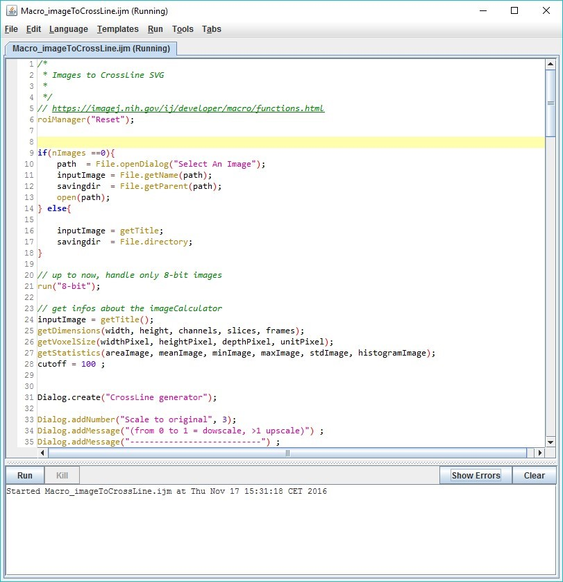
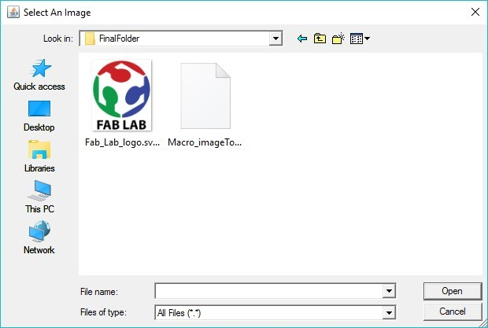
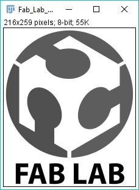
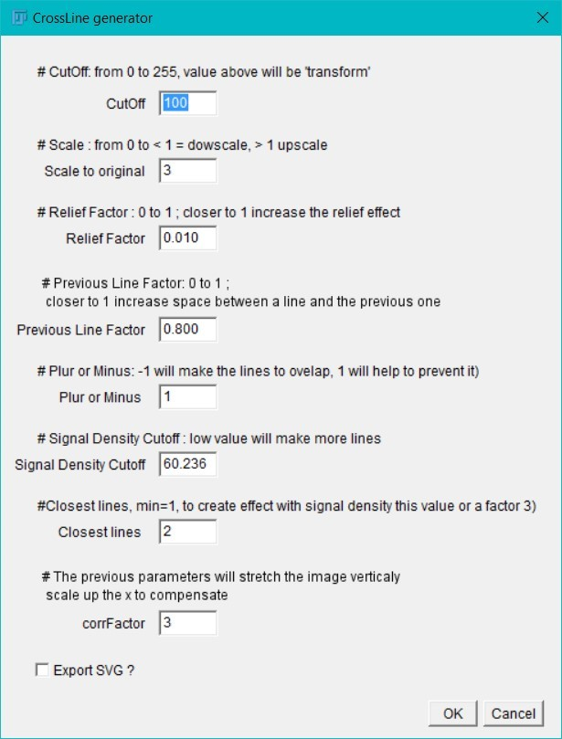
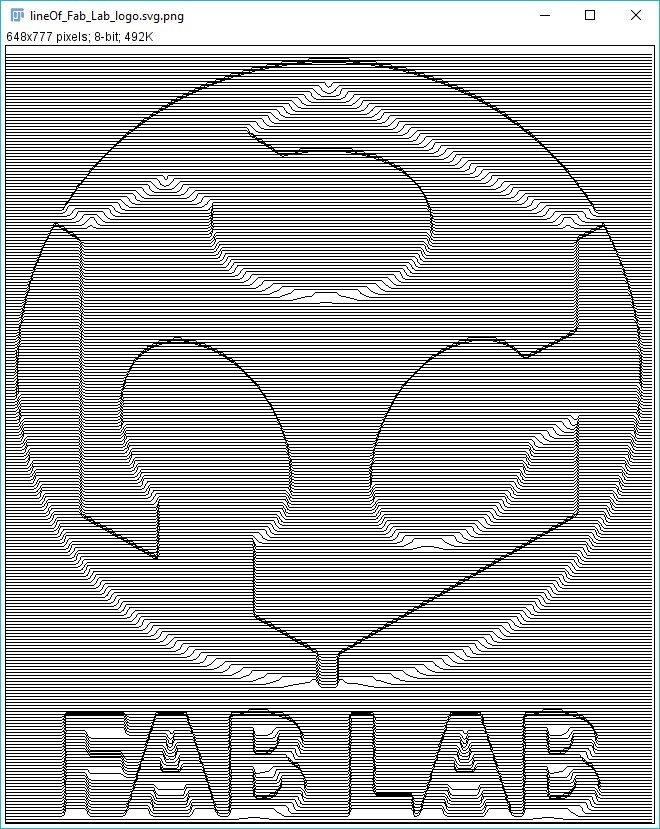
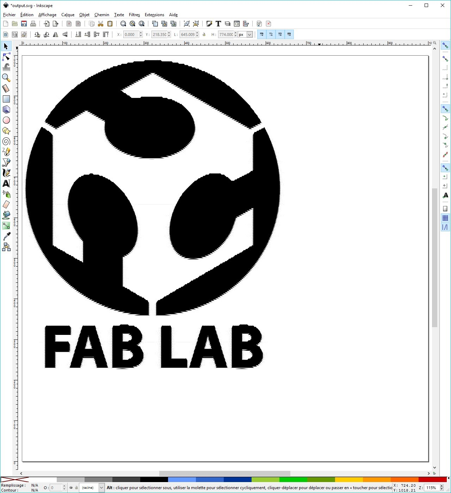
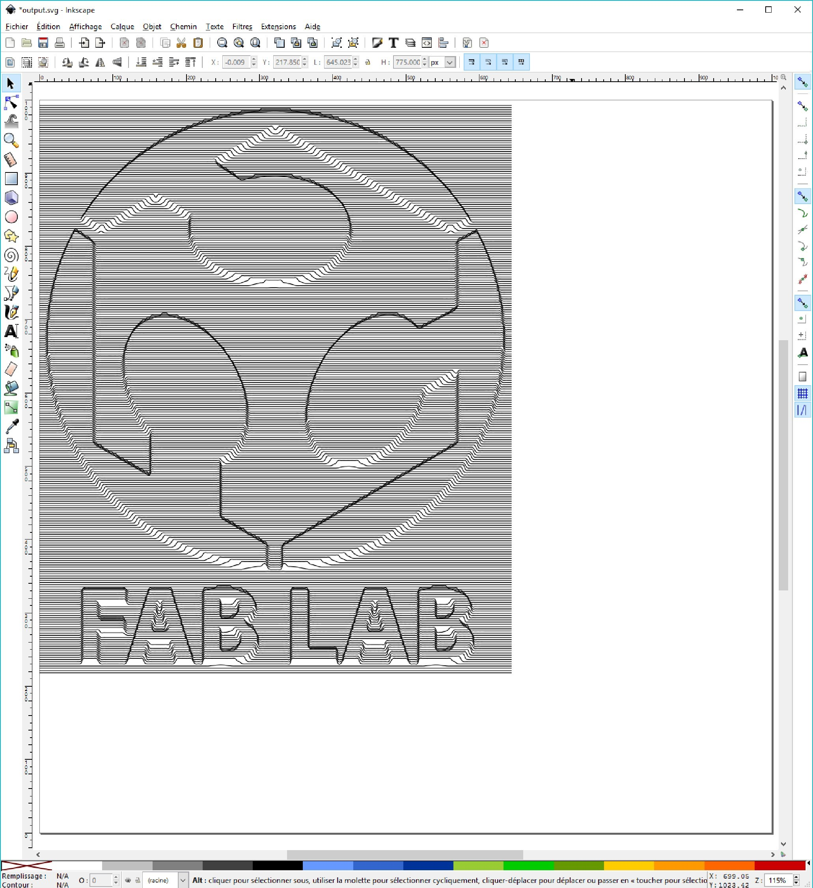

# Bitmap Image To Vecotrized Crosslines

A small ImageJ macro to convert image into a crosslines image ( making a "relief effect") output as svg.

## Source and Crosslines result

## Dependencies

- [Fiji/Imagej](http://imagej.net/Fiji/Downloads)
- [Inkscape](https://inkscape.org/)

## Usage to generate an SVG

1. Download / Open the [Macro_imageToCrossLines.ijm](src/Macro_imageToCrossLines.ijm) in Fijji (Drag & Drop onto the toolbar)
  
2. On the new window with the code hit **RUN**
  
3. Select the image to be converted (example: [Fab_Lab_logo.png](sample/Fab_Lab_logo.png))
  
4. The image is automatically converted to 8bit and a new window allows to configure some parameters.
  Press **OK** to convert.
  
  
5. You get a pixelated *preview* and a new SVG file (example: [output.svg](sample/output.svg)) is saved in the same folder as the original image (if you have selected the option)

  

## Usage improve the result with Inkscape (optional)

1. Open SVG file in Inkscape
  
2. Select All, Change Fill to empty and Countour/ Strokes to Black
  

## Authors
@romainGuiet

Thanks to @lacan for the help with debugging the code :)